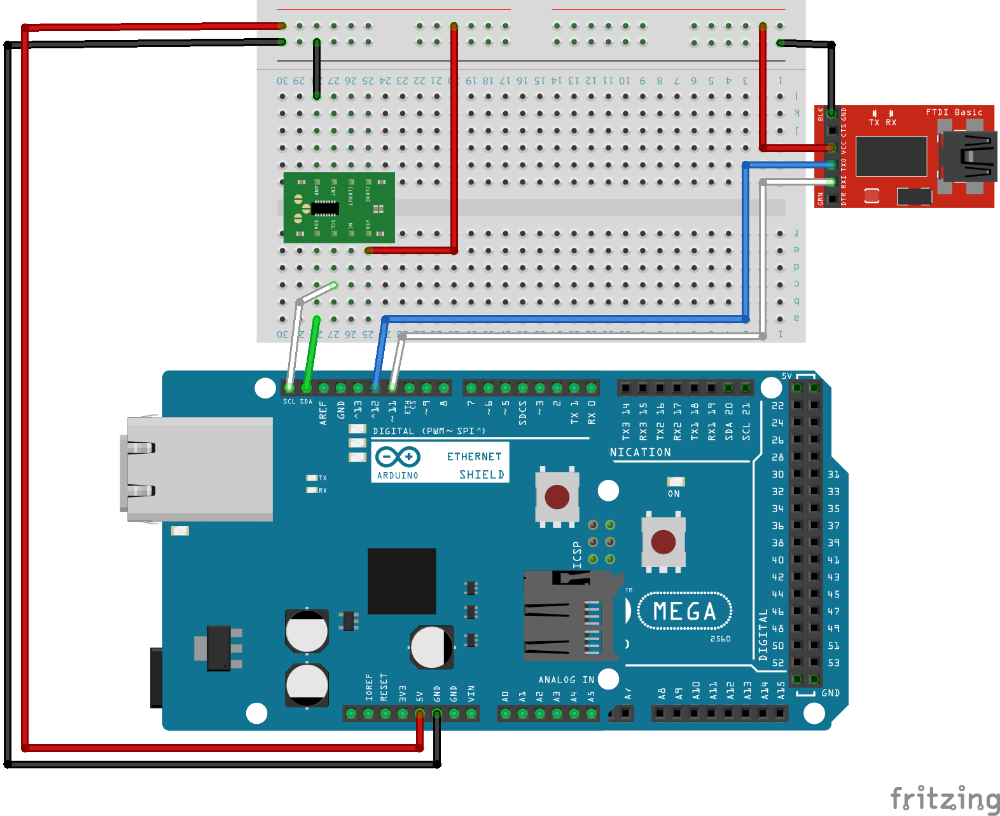
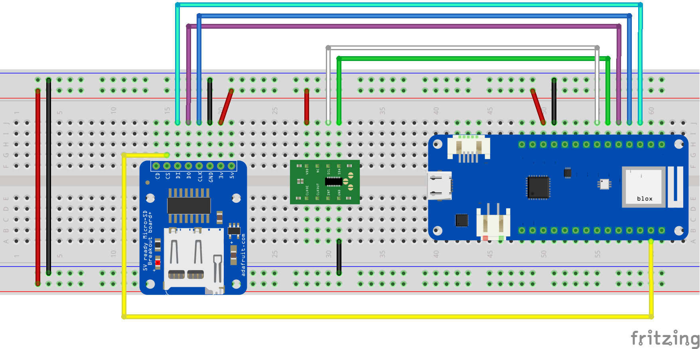
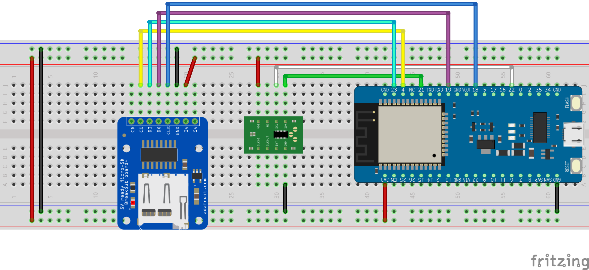

# simple logging

シンプルにlogを書き出すだけのサンプルプログラムで，syslogプロトコル，ファイル，シリアルへの出力は本スケッチのconfig.hとライブラリのconfig.hで切り替えてください．

## インストール

当然ではありますが，syslogのライブラリが必要なので，それをインストールしてください．
- [syslog](https://github.com/houtbrion/Syslog)

本スケッチ用に以下のものもインストールしてください．
- [detectArduinoHardware](https://github.com/houtbrion/detectArduinoHardware)
- detectArduinoHardwareのextensionディレクトリに収納されている拡張機能ライブラリarduinoHardwareHelper
- [NiUtils](https://github.com/houtbrion/NiUtils)

RTCを利用する人は，以下のライブラリをインストールしてください．
- [RTC_U](https://github.com/houtbrion/RTC_U)
- [RTC_U](https://github.com/houtbrion/RTC_U)内の各RTCチップ用のドライバと，extentionもインストールしてください．

もし，ESP8266でソフトウェアシリアルを利用する場合は，特別なライブラリが必要になるため，以下のライブラリをインストールしてください．
- [EspSoftwareSerial](https://www.arduino.cc/reference/en/libraries/espsoftwareserial/)

## 動作確認済みハードウェア

|CPUアーキ|本体|ネットワークI/F|SD I/F|RTC|ソフトシリアル|
|---|---|---|---|---|---|
|AVR|[Arduino Mega 2560 R3](https://www.arduino.cc/en/Main/arduinoBoardMega2560)|[Ethernet Shield 2](https://store-usa.arduino.cc/products/arduino-ethernet-shield-2)|[Ethernet Shield 2](https://store-usa.arduino.cc/products/arduino-ethernet-shield-2)|[RTC-8564NB](https://akizukidenshi.com/catalog/g/gI-00233/)|[FT234XD](https://akizukidenshi.com/catalog/g/gK-14652/)|
|AVR|同上|同上|同上|[DS1307](https://akizukidenshi.com/catalog/g/gK-15488/)|－|
|SAMD|[Arduino MKR WiFi 1010](https://store-usa.arduino.cc/products/arduino-mkr-wifi-1010?selectedStore=us)|NINA-W102(内蔵)|[Adafruit MicroSD card breakout board+](https://www.adafruit.com/product/254)|[RTC-8564NB](https://akizukidenshi.com/catalog/g/gI-00233/)|－|
|ESP32|[ESPr Developer 32](https://www.switch-science.com/catalog/3210/)|ESP32内蔵WiFi|[Adafruit MicroSD card breakout board+](https://www.adafruit.com/product/254)|[RTC-8564NB](https://akizukidenshi.com/catalog/g/gI-00233/)|－|

## 配線
Fritzingで図面を起こしてありますが，使っているハードウェアモジュールのFrintzing用定義が回路図の作成に対応していないため，回路図はありません．

ピンの接続関係が不明な場合は同封したFritzingで図面ファイルを開いて確認してください．
### Arduino Mega

### Arduino MKR WiFi 1010

### ESP32開発用ボード

